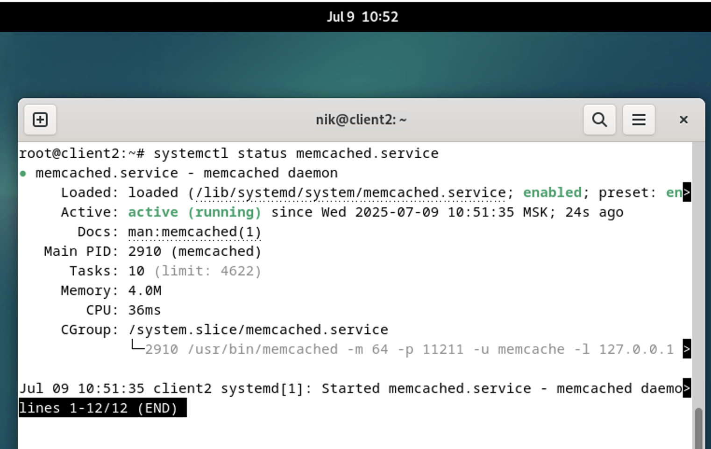
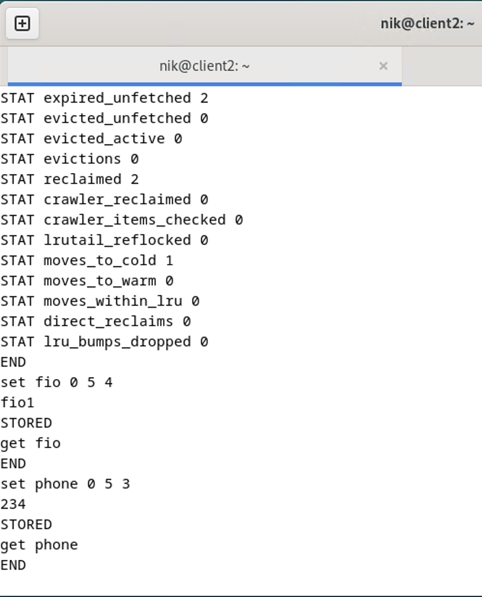
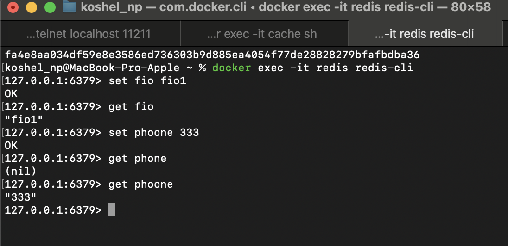
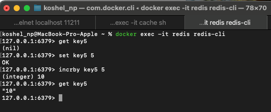

# Домашнее задание к занятию "`Кеширование Redis/memcached`" - `Кошель Николай Павлович`

### Задание 1. Кеширование

Приведите примеры проблем, которые может решить кеширование.

// Повышение производительности. Когда данные хранятся далеко (например, на удалённом сервере), каждый раз их получение занимает много времени. Кэширование позволяет «подтянуть» эти данные поближе, сокращая время ожидания. 
Разгрузка основных систем. Кеширование забирает на себя львиную долю повторяющихся запросов, что даёт базе данных возможность обрабатывать сложные, уникальные операции.
Экономия ресурсов. Меньше запросов к диску, меньше сетевого трафика между сервисами, ниже нагрузка на процессоры основной базы данных.
Удобство и доступность ресурсов. Если результат уже доступен в кэше, можно вернуть результат без необходимости использования базовых ресурсов, и недоступность этих ресурсов не будет проблемой. 

### Задание 2. Memcached

Установите и запустите memcached.

Приведите скриншот systemctl status memcached, где будет видно, что memcached запущен.



### Задание 3. Удаление по TTL в Memcached

Запишите в memcached несколько ключей с любыми именами и значениями, для которых выставлен TTL 5.

Приведите скриншот, на котором видно, что спустя 5 секунд ключи удалились из базы.



Создание и проверка через скрипт
```
import memcache
import time

mc = memcache.Client(['127.0.0.1:11211'], debug=0)

key = 'key'
value = 'value'
ttl = 5  # Срок жизни ключа в секундах

# Сохраняем ключ с TTL
mc.set(key, value, time=ttl)

# Запоминаем время сохранения ключа
start_time = time.time()

# Получаем данные
data = mc.get(key)

# Если данные существуют, проверяем срок жизни
if data:
    elapsed_time = time.time() - start_time
    remaining_time = ttl - elapsed_time
    if remaining_time > 0:
        print(f"Ключ '{key}' существует, оставшееся время жизни: {remaining_time:.2f} секунд")
    else:
        print(f"Ключ '{key}' устарел")
else:
    print(f"Ключ '{key}' не найден")

# Удаления ключа
mc.delete(key)

```

### Задание 4. Запись данных в Redis

Запишите в Redis несколько ключей с любыми именами и значениями.

Через redis-cli достаньте все записанные ключи и значения из базы, приведите скриншот этой операции.


Получение значений через скрипт

```
import redis

# Подключения к Redis
redis_host = 'localhost'
redis_port = 6379
redis_db = 0

# Создаем подключение
r = redis.Redis(host=redis_host, port=redis_port, db=redis_db)

# Получаем курсор и итерируем по ключам
cursor = '0'
while cursor != 0:
    cursor, keys = r.scan(cursor=cursor, match='*', count=100)
    for key in keys:
        value = r.get(key)
        print(f"Ключ: {key.decode('utf-8')}, Значение: {value.decode('utf-8')}")
```

### Дополнительные задания (со звёздочкой*)

Эти задания дополнительные, то есть не обязательные к выполнению, и никак не повлияют на получение вами зачёта по этому домашнему заданию. Вы можете их выполнить, если хотите глубже разобраться в материале.

### Задание 5*. Работа с числами

Запишите в Redis ключ key5 со значением типа "int" равным числу 5. Увеличьте его на 5, чтобы в итоге в значении лежало число 10.

Приведите скриншот, где будут проделаны все операции и будет видно, что значение key5 стало равно 10.

